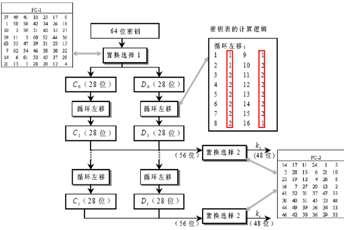

## DES加解密算法设计说明

### 加解密概述

明文：任意长度的字符串。

密文：由16进制数字组成的字符串。

密钥：8位字符。

#### DES.h

```c++
//DES.h
#pragma once
#include <bitset>
#include <iostream>
using namespace std;

void generateKeys(string& k);    // 生成子密钥
// 由于密文转字符容易乱码。故明文为普通字符串，密文为16进制数组成的字符串
string encrypt(string &s);       // 加密函数
string decrypt(string &s);       // 解密函数
```

### 单次加解密

#### 特征

- 分组加密算法：明文和密文为64位分组长度；

- 对称算法：加密和解密除密钥编排不同外，使用同一算法；

- 密钥长度：64位，但每个字节第8位为奇偶校验位，可忽略；

- 密钥可为任意的56位数，但存在弱密钥，尽量避开；

- 采用混乱和扩散的组合，每个组合先替代后置换，共16轮；

- 只使用了标准的算术和逻辑运算，易于实现。

#### 流程图


#### 单次加解密函数代码（以加密为例）

```c
// 单次DES加密（64位）
string encryptOnce(string s)
{
	bitset<64> plain = charToBitset(s.c_str());
	string result;
	bitset<64> temp_cipher;
	bitset<64> current_bits;
	bitset<32> left;
	bitset<32> right;
	bitset<32> new_left;
	// 第一步：初始置换IP
	for (int i = 0; i < 64; ++i)
		current_bits[63 - i] = plain[64 - IP[i]];
	// 第二步：获取 Li 和 Ri，进行十六轮迭代（乘积变换）
	for (int i = 32; i < 64; ++i)
		left[i - 32] = current_bits[i];
	for (int i = 0; i < 32; ++i)
		right[i] = current_bits[i];
	for (int round = 0; round < 16; ++round)
	{
		new_left = right;
		right = left ^ f(right, g_sub_key[round]);
		left = new_left;
	}
	// 第三步：合并L32和R32，注意合并为 R32L32
	for (int i = 0; i < 32; ++i)
		temp_cipher[i] = left[i];
	for (int i = 32; i < 64; ++i)
		temp_cipher[i] = right[i - 32];
	// 第四步：初始逆置换IP^(-1)
	current_bits = temp_cipher;
	for (int i = 0; i < 64; ++i)
		temp_cipher[63 - i] = current_bits[64 - IP_1[i]];
	// 返回密文
	return temp_cipher.to_string();
}
```

### 初始置换IP和IP^(-1)

- 作用：将64位明文打乱重排

#### 示意图


### 乘积变换（核心部分）

#### 原理

- 将经过*IP*置换后的数据分成32 bit的左右两组；

- 每次迭代时只对右边的32 bit进行一系列的加密变换，在此轮迭代即将结束时，把左边的32 bit与右边得到的32 bit逐位模2相加，作为下一轮迭代时右边的段；

- 将原来右边未经变换的段直接送到左边的寄存器中作为下一轮迭代时左边的段；

- 在每一轮迭代时，右边的段要经过选择扩展运算E、密钥加密运算、选择压缩运算S、置换运算P和左右混合运算。


#### 乘积变换函数代码

```c
//乘积变换f，接收32位数据和48位子密钥，产生一个32位的输出
bitset<32> f(bitset<32> R, bitset<48> k)
{
	bitset<48> expandR;
	// 第一步：选择扩展运算E，32->48
	for (int i = 0; i < 48; ++i)
		expandR[47 - i] = R[32 - E[i]];
	// 第二步：异或（模2相加）
	expandR = expandR ^ k;
	// 第三步：选择压缩运算S，48->32
	bitset<32> output;
	int x = 0;
	for (int i = 0; i < 48; i = i + 6)
	{
		//首位2位决定行，中间4位决定列
		int row = expandR[47 - i] * 2 + expandR[47 - i - 5];
		int col = expandR[47 - i - 1] * 8 + expandR[47 - i - 2] * 4 + expandR[47 - i - 3] * 2 + expandR[47 - i - 4];
		int num = S_BOX[i / 6][row][col];
		bitset<4> binary(num);
		output[31 - x] = binary[3];
		output[31 - x - 1] = binary[2];
		output[31 - x - 2] = binary[1];
		output[31 - x - 3] = binary[0];
		x += 4;
	}
	// 第四步：置换运算P，32->32
	bitset<32> tmp = output;
	for (int i = 0; i < 32; ++i)
		output[31 - i] = tmp[32 - P[i]];
	return output;
}
```

#### 选择扩展运算E

##### 作用

- 通过置换表E，将输入的32 bit *R*i-1扩展成48 bit的输出

##### 原理

- 令*s*表示运算*E*原输入数据比特的原下标，则运算*E*的输出是将原下标*s*=0或1(mod 4)的各比特重复一次得到的，即对原第32, 1, 4, 5, 8, 9, 12, 13, 16, 17, 20, 21, 24, 25, 28, 29各位都重复一次,实现数据扩展。

#### 模2求和

- 将子密钥产生器输出的48 bit子密钥*k*i与选择扩展运算*E*输出的48 bits数据按位模2相加。

#### 子密钥产生器

##### 原理

- 在64 bit初始密钥中有8位为校验位，其位置号为8、16、32、48、56和64。其余56位为有效位，用于子密钥计算。

- 置换选择PC1：将这56位送入置换选择PC_1进行坐标置换；

- 循环移位置换：将上述结果分成两组28 bit，分别送入left和right中。在各次迭代中，left和right分别将存数进行左循环移位置换；

- 置换选择PC2：每次移位后，将left和right寄存器原存数送给置换选择PC_2。置换选择PC_2将left中第9、18、22、25位和right中第7、9、15、26位删去，并将其余数字置换位置后送出48 bit数字作为第i次迭代时所用的子密钥ki。

##### 函数代码

```c
// 生成16个48位的子密钥
void generateKeys(string &k)
{
	bitset<64> key = charToBitset(k.c_str()); // 64位密钥
	bitset<56> realKey;
	bitset<28> left;
	bitset<28> right;
	bitset<48> compressKey;
	// 去掉奇偶标记位，将64位密钥变成56位
	for (int i = 0; i < 56; ++i)
		realKey[55 - i] = key[64 - PC_1[i]];
	// 生成子密钥，保存在 subKeys[16]中
	for (int round = 0; round < 16; ++round)
	{
		// 前28位与后28位
		for (int i = 28; i < 56; ++i)
			left[i - 28] = realKey[i];
		for (int i = 0; i < 28; ++i)
			right[i] = realKey[i];
		// 左移
		left = leftShift(left, shiftBits[round]);
		// 右移
		right = leftShift(right, shiftBits[round]);
		// 压缩置换，由56位得到48位子密钥
		for (int i = 28; i < 56; ++i)
			realKey[i] = left[i - 28];
		for (int i = 0; i < 28; ++i)
			realKey[i] = right[i];
		for (int i = 0; i < 48; ++i)
			compressKey[47 - i] = realKey[56 - PC_2[i]];
		g_sub_key[round] = compressKey;
	}
}
```

##### 示意图



#### 压缩置换S

##### 原理

- 将前面送来的48 bit数据自左至右分成8组，每组为6 bit；而后并行送入8个S盒，每个S盒为一非线性代换网络，有4个输出。

##### 示意图


#### 置换运算P：

##### 作用

- 通过置换表P，对*S*1至*S*8盒输出的32 bit数据进行坐标置换。


