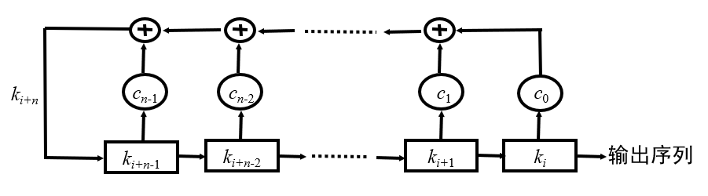
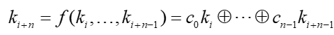
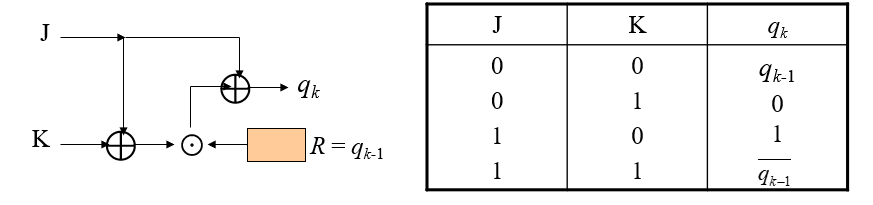
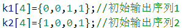

# LFSR-JK触发器
## LFSR
  
k为移位寄存器  
  
c为反馈系数  
例如：  
如果c0=1,c1=1,c2=0,c3=1  
k0=1,k1=0,k2=0,k3=1  
输出k0=1，则新的k3=c0 * k0 ⊕ c1 * k1 ⊕ c2 * k2 ⊕ c3 * k3=0  
## JK触发器
  
将两个LFSR的输出序列作为JK触发器的输入，JK触发器的输出作为密钥流即可  
## 注
LFSR并没有讲怎么用密钥控制密钥流，所以我自己想了一个：  
①key四个字符为一组，各组异或结果的最低位（0或1）为四个反馈系数初始值；  
②不足四个字符的密钥：最低位重复填充四个系数；  
③密钥按四个字符一组分组后剩下的字符：最低位依次和四个系数或，然后赋值给系数  
  
  
- 两组LFSR四个寄存器初始值如下：  
  
  
- 可加密任意字符串，密钥为任意字符串
